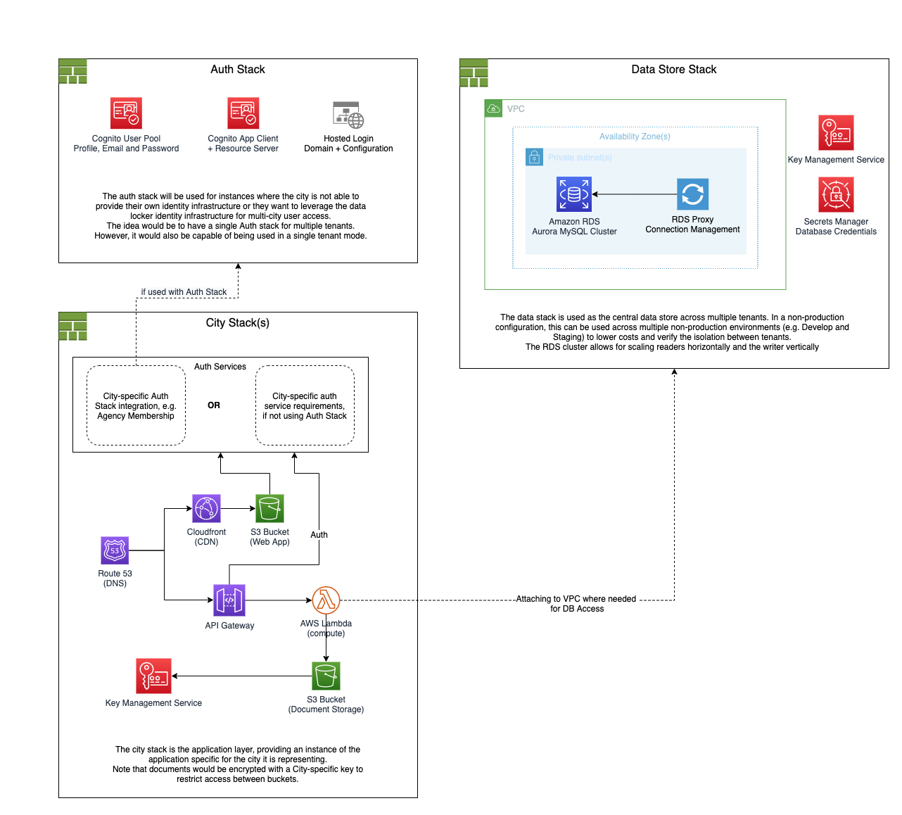

# Homeless Data Locker (HDL)

Homeless Data Locker project for NYC and Baltimore

## Getting Started

This repository uses yarn and yarn workspaces.

Follow [instructions here](https://classic.yarnpkg.com/en/docs/install/) to install yarn on your system

Install all local dependencies via

```bash
yarn
```

## Creating a new Package (i.e. adding to the packages/ directory)

Create the new folder and move to it

```bash
mkdir -p packages/hello-world-lambda && cd packages/hello-world-lambda
```

Initialise the package

```bash
yarn init
```

and follow the prompts.

If you're using tools such as vue cli to bootstrap a project, after project set up you will need to execute the yarn commands manually to add all the packages required from the root.

### All packages MUST have

- A package.json file
- A registered `build` script in packages.json, if it needs to be built
- A registered `test` script in packages.json, if no tests a justification is required
- All dependencies added through root workspace so they are added to the lockfile

### All packages SHOULD have

- A README.md outlining any non-standard commands and how to work with the package.
- A `src` directory for all application code
- A `src/__tests__` directory for all test code

## Local development

### Frontend

Start the nuxt development server with `yarn fe dev`. You should be able to open the app on `http://localhost:3000/`.

> Note: `fe` is a shorthand to run yarn scripts in the frontend workspace from the root workspace

For more info see the [frontend readme](./packages/frontend/README.md)

## Storybook

Storybook helps you document components for reuse and automatically visually test your components to prevent bugs. Run storybook with `yarn storybook`. You can access the storybook by navigating to `http://localhost:3003/` in your browser. For more information see the [storybook docs](https://storybook.js.org/docs/vue/get-started/introduction).

### Mock API

Install [docker engine](https://docs.docker.com/docker-for-mac/install/).

Installing the docker engine desktop app also installs [docker compose](https://docs.docker.com/compose/install/#install-compose-on-macos), which is required.

> Note: Installing docker via homebrew proved to be a pain to get working. Not recommended.

If you have followed the steps correctly, `yarn mockapi` will start a mock api on port 8080, which you can verify by navigating to `http://localhost:8080/v1/documents/1` in your browser. You should get a response similar to:

```json
{
  "createdDate": "1835-05-28T14:19:46Z",
  "description": "Non. Est dicta tenetur voluptatem.",
  "expiryDate": "1994-08-29T05:29:01Z",
  "format": "JPEG",
  "id": "Earum. Perferendis quia. Et enim magnam eum. Dolor soluta suscipit.",
  "links": {},
  "source": "PHOTO",
  "type": "PROOF_OF_INCOME"
}
```

#### Regenerating the API Client

You can use the [OpenAPI Generator](https://github.com/OpenAPITools/openapi-generator#table-of-contents) docker image to regenerate the `api-client` (packages/api-client) with the following command:

```bash
docker run --rm -v "${PWD}:/local" openapitools/openapi-generator-cli:latest-release generate \
    -i /local/docs/api.yaml \
    -g typescript-axios \
    -o /local/packages/api-client
```

> note: run this from the root directory

## Architecture

High level infrastructure:



### Key concepts

#### Data Encryption

Encryption at rest is applied to the following storage mechanisms:

1. S3 Buckets
2. Database drives

Encryption in-transit is applied via HTTPS between clients and API Gateway.

#### Serverless compute

Scalable and serverless compute powered by AWS Lambda

#### Isolated multi-tenancy

If a City is configured in a multi-tenant manner, documents are encrypted with a city-specific KMS key.

A City stack will provision its own database and credentials on creation so it is fully isolated from other City data.
